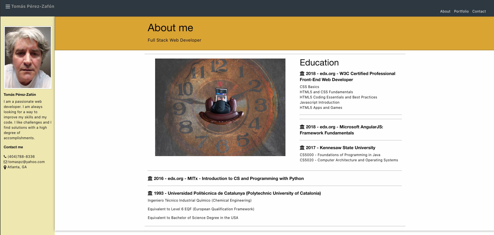
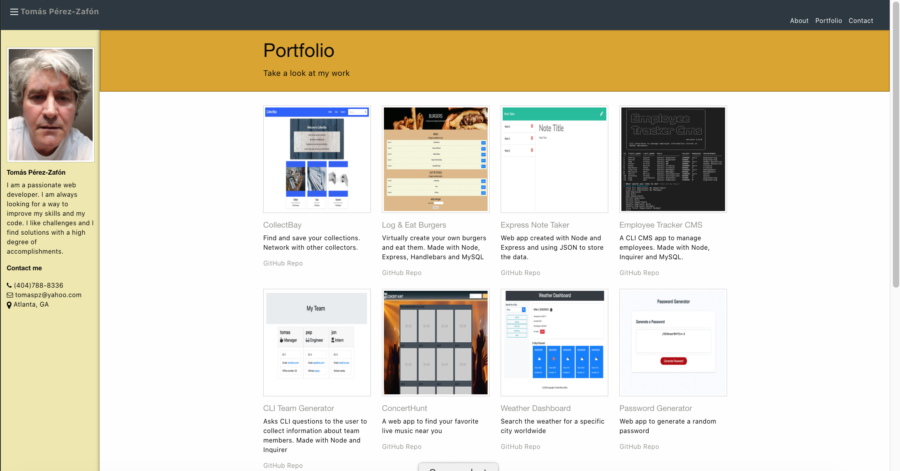
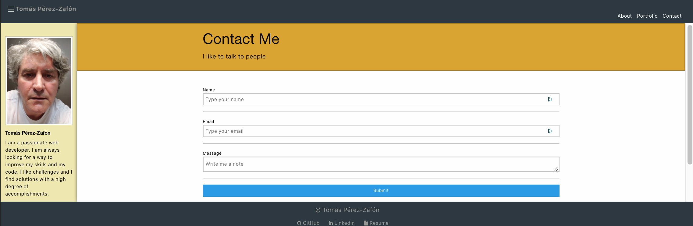

# Tomás Pérez-Zafón Resume Portfolio made with React JS

I transformed a plain HTML website into a [React JS](https://reactjs.org/) website, which is also using the [`react-router-dom`](https://www.npmjs.com/package/react-router-dom) npm package.

This project was bootstrapped with [`create-react-app`](https://github.com/facebook/create-react-app) at the root folder of an empty repository. 

The original HTML website was build using Semantic UI as a styling framework, so I had to import the CDN into the React's `/public/index.html` file.

Then, I installed the package `react-router-dom`.

I began to create the file structure and the react components. Since the original website had only 3 pages (About, Portfolio and Contact), I decided to create a class component for each one of them inside the `container` directory. This class component will allow me later to pass props down to other components.

Since the pages had some common used parts, like the navigation bar, header, etc, I decided to make them a shared component, so they can be reused in several pages.

The React `src` directory has the following structure:

As you can see, under `/components/Shared`, the `Navbar.jsx`, the `Header.jsx`, the `Sidebar.jsx` and the `Footer.jsx` are separate components and they are reused in different pages.

Also, I decided to create the component `AllProjects.jsx` that will contain all my projects. This is done via the `Project.jsx` component and populated with different data for the different projects.
- - -
## Website Screenshots

About Page

- - -
Portfolio Page

- - -
Contact Page

- - -
## To Learn More About React JS

* [Create React App documentation](https://facebook.github.io/create-react-app/docs/getting-started).

* [React documentation](https://reactjs.org/).

* [Code Splitting](https://facebook.github.io/create-react-app/docs/code-splitting)

* [Analyzing the Bundle Size](https://facebook.github.io/create-react-app/docs/analyzing-the-bundle-size)

* [Progressive Web App](https://facebook.github.io/create-react-app/docs/making-a-progressive-web-app)

* [Advanced Configuration](https://facebook.github.io/create-react-app/docs/advanced-configuration)

* [Deployment](https://facebook.github.io/create-react-app/docs/deployment)
